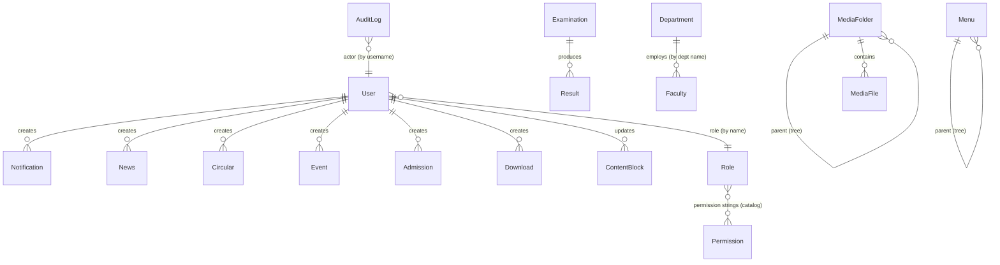

# JNTUAWEB v2 — MongoDB Database Design

35 collections modelled with Mongoose. This document covers the schemas, relationships, indexes, validation, timestamps, and the soft-delete strategy.

## Conventions (apply to every collection)

- **Timestamps** — every schema uses `{ timestamps: true }`, giving `createdAt` / `updatedAt` (a few use domain-specific names, e.g. `uploadedAt`, `at`).
- **Soft delete** — a global Mongoose plugin adds `isDeleted` (Boolean, default `false`, indexed) and `deletedAt` (Date) to **every** collection. Read queries (`find`, `findOne`, `countDocuments`, …) automatically exclude `isDeleted: true`. Escape hatches: `Model.withDeleted()`, `Model.onlyDeleted()`, and `.setOptions({ withDeleted: true })`. Instances have `softDelete()` / `restore()`. The generic delete endpoint soft-deletes by default (`?hard=1` to purge); `POST /admin/<resource>/:id/restore` un-deletes. Append-only/config collections (`AuditLog`, `SiteSetting`) carry the fields but never set them.
- **Relationships** — references use `ObjectId` + Mongoose `ref` (MongoDB has no joins; we populate on demand). Denormalised keys (e.g. `directorateKey`, `section`) are used where a soft link is enough.
- **Validation** — `required`, `enum`, `match`, `min/maxlength` at the schema level; the API returns validation errors in the `{ success, data, error }` envelope.
- **Indexes** — single-field indexes on lookup/filter fields; compound indexes on common query pairs (listed per collection and summarised at the end).

---

## 1. Identity & Access

### `users`
| Field | Type | Rules |
|---|---|---|
| username | String | required, unique, lowercase |
| email | String | lowercase |
| passwordHash | String | required, `select:false` |
| fullName | String | |
| role | String | enum `admin\|director`, indexed |
| directorate | String | indexed (e.g. `otpri`) |
| isActive | Boolean | default true |
| mustChangePwd | Boolean | default false |
| lastLogin | Date | |

Methods: `verifyPassword`, `hashPassword` (bcrypt, cost 12), `toSafeJSON`. **Indexes:** `username` (unique), `role`, `directorate`.

### `roles`
| Field | Type | Rules |
|---|---|---|
| name | String | required, unique, lowercase |
| label | String | |
| permissions | [String] | e.g. `['notifications:write','users:manage']`; `*` = all |
| isSystem | Boolean | system roles can't be renamed/deleted |

**Relationship:** `users.role` (string) resolves to a `roles.name`; falls back to seeded system roles.

### Permissions
Permissions are **not a collection** — they're a fixed catalog (`config/permissions.js`) of `<resource>:<action>` strings referenced by `roles.permissions`. This keeps them versioned in code and avoids orphaned permission rows. Enforced by `requirePermission()` middleware.

---

## 2. Departments & People

### `departments`
`name*`, `code` (idx), `college`, `hod`, `description` (HTML), `website`, `email`, `sortOrder` (idx), `isActive`. **Indexes:** `code`, `sortOrder`.

### `faculty`
`name*`, `designation`, `department` (idx), `qualification`, `specialization`, `experience`, `email`, `mobile`, `researchArea`, `publications`, `achievements`, `photo`, `isActive`, `sortOrder` (idx).

### `students`
`name*`, `rollNo` (idx), `programme`, `branch`, `year`, `category` (idx: `btech\|foreign\|gold-medal\|alumni…`), `email`, `photo`, `meta` (Mixed). Category-discriminated to cover the legacy per-directorate student lists.

---

## 3. Notices, News & Events

### `notifications` (Notices)
`title*`, `category` (enum `news\|exam\|admission\|research\|placement\|sports\|tenders`, idx), `attachment`, `isActive`, `createdBy → User`.

### `news`
`title*`, `content` (HTML), `category`, `attachment`, `isPublished` (idx), `createdBy → User`.

### `circulars`
`title*`, `refNo`, `category` (idx), `circularDate` (idx), `attachment`, `isNewItem`, `isActive`, `createdBy → User`.

### `events`
`title*`, `description` (HTML), `category` (idx), `startDate*` (idx), `endDate`, `venue`, `banner`, `registrationUrl`, `isPublished` (idx), `createdBy → User`.

---

## 4. Academics

### `admissions`
`title*`, `programme*`, `academicYear` (match `YYYY[-YY]`), `category` (enum `UG\|PG\|PhD\|Diploma\|Other`, idx), `description` (HTML), `openDate`, `closeDate` (idx), `applyUrl`, `attachment`, `status` (enum `open\|closed\|upcoming`, idx), `isPublished`, `createdBy → User`. **Compound index:** `{ status, closeDate }`.

### `examinations`
`title*`, `examType` (enum `Regular\|Supplementary\|Revaluation\|Recounting\|Fee\|TimeTable\|Other`, idx), `regulation`, `programme`, `semester`, `examDate` (idx), `lastDate`, `attachment`, `notes` (HTML), `isPublished` (idx). **Compound index:** `{ examType, examDate }`.

### `results`
`title*`, `examination → Examination` (optional link), `regulation`, `programme`, `semester`, `month`, `resultUrl`, `attachment`, `publishedOn` (idx), `isPublished` (idx). **Compound index:** `{ programme, publishedOn }`.

### `downloads`
`title*`, `category` (idx), `section` (idx, directorate scope), `attachment`, `fileType`, `sortOrder`, `isActive`, `createdBy → User`.

### `regulations`, `senate_docs`, `dacp_files` (+ `dacp_circulars`, `dacp_newsletters`, `dacp_senate`), `dafa_docs`
Academic document stores migrated from the legacy tables/JSON. `dafa_docs` is section-discriminated (one collection replacing 30+ JSON files); `dacp_files` carries `isNewItem` (renamed from the reserved `isNew`).

---

## 5. Media & Files

### `mediafolders`
`name*`, `parentId → MediaFolder` (self-ref tree, idx), `createdBy`.

### `mediafiles` (Files & Images)
`folderId → MediaFolder` (idx), `originalName*`, `storedName*`, `ext`, `mimeType`, `fileType` (idx: `image\|pdf\|document…`), `size`, `url`, `storagePath`, `uploadedBy`. **Relationship:** many files → one folder; folders self-nest.

### `galleryitems` (Gallery)
`filename*`, `caption`, `category` (idx), `uploadedBy → User`.

### `emagazines`
`monthYear*`, `issueDate*` (idx), `filename`, `uploadedBy → User`.

---

## 6. Navigation & Dynamic Content

### `menus`
`label*`, `url`, `location` (idx: `header\|footer\|quick`), `parentId → Menu` (self-ref tree, idx), `target` (enum `_self\|_blank`), `order` (idx), `isActive`. Enables a fully CMS-managed navigation tree.

### `pagecontents` (Pages / CMS)
`key*` (unique, idx), `heading`, `body` (HTML), `updatedBy`. Admin-editable page bodies; the public site prefers these over the static content manifest.

### `contentblocks` (Dynamic Content)
`key*` (unique, idx, e.g. `home.hero`), `type` (enum `html\|text\|json\|list\|image`), `page` (idx), `title`, `body`, `data` (Mixed — arbitrary JSON widgets), `order`, `isActive`, `updatedBy → User`. Reusable keyed blocks any page/section can render.

### `slides`, `directorate_contents`, `administrations`, `honoris_causas`, `mous`
Homepage carousel, per-directorate director/about content (`directorateKey` unique), leadership profiles (`roleKey` unique: chancellor/vc/rector/registrar), honorary doctorates, and MOUs (`mouType` enum `National\|International`).

---

## 7. System

### `sitesettings` (Settings)
`key*` (unique), `value`. Simple key/value store, read as a map.

### `auditlogs` (Logs)
`actor` (idx), `action` (idx: `create\|update\|delete\|login\|logout`), `resource` (idx), `resourceId`, `method`, `path`, `status`, `ip`, `meta` (Mixed), `at` (idx desc). **Append-only.** Written by audit middleware on every successful admin mutation + auth event.

---

## Relationships (ERD)

Legend: solid refs are `ObjectId`/`ref` relationships; `Role` and `Department` links are resolved by natural key (name), and `Permission` is a code catalog, not a collection.

---

## Index Summary

| Collection | Indexes |
|---|---|
| users | `username`(uniq), `role`, `directorate`, `isDeleted` |
| roles | `name`(uniq) |
| admissions | `category`, `closeDate`, `status`, `{status,closeDate}` |
| examinations | `examType`, `examDate`, `isPublished`, `{examType,examDate}` |
| results | `publishedOn`, `isPublished`, `{programme,publishedOn}`, `examination`(ref) |
| events | `category`, `startDate`, `isPublished` |
| notifications | `category` |
| circulars | `category`, `circularDate` |
| downloads | `category`, `section` |
| mediafiles | `folderId`, `fileType` |
| mediafolders | `parentId` |
| menus | `location`, `parentId`, `order` |
| pagecontents / contentblocks | `key`(uniq), `page` |
| auditlogs | `actor`, `action`, `resource`, `at`(desc) |
| *all* | `isDeleted` (from the global soft-delete plugin) |

---

## Soft-Delete Strategy (summary)

1. Global plugin → `isDeleted` + `deletedAt` on all schemas.
2. Reads exclude deleted automatically; `?deleted=with|only` on list endpoints reveals them (trash view).
3. `DELETE /admin/<r>/:id` → soft-delete; `?hard=1` → permanent.
4. `POST /admin/<r>/:id/restore` → un-delete.
5. Dashboard counts use `countDocuments` (soft-delete-aware); the legacy `estimatedDocumentCount` was replaced so counts don't include trashed rows.
